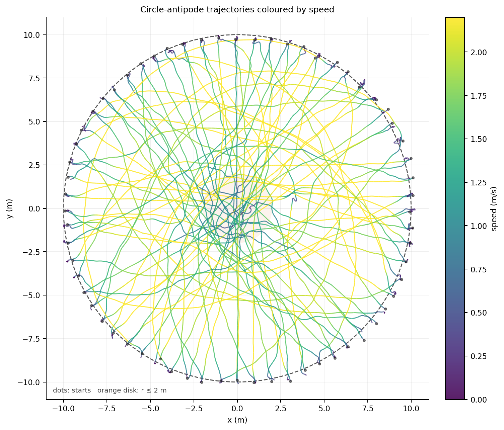
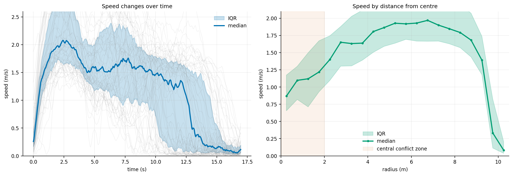
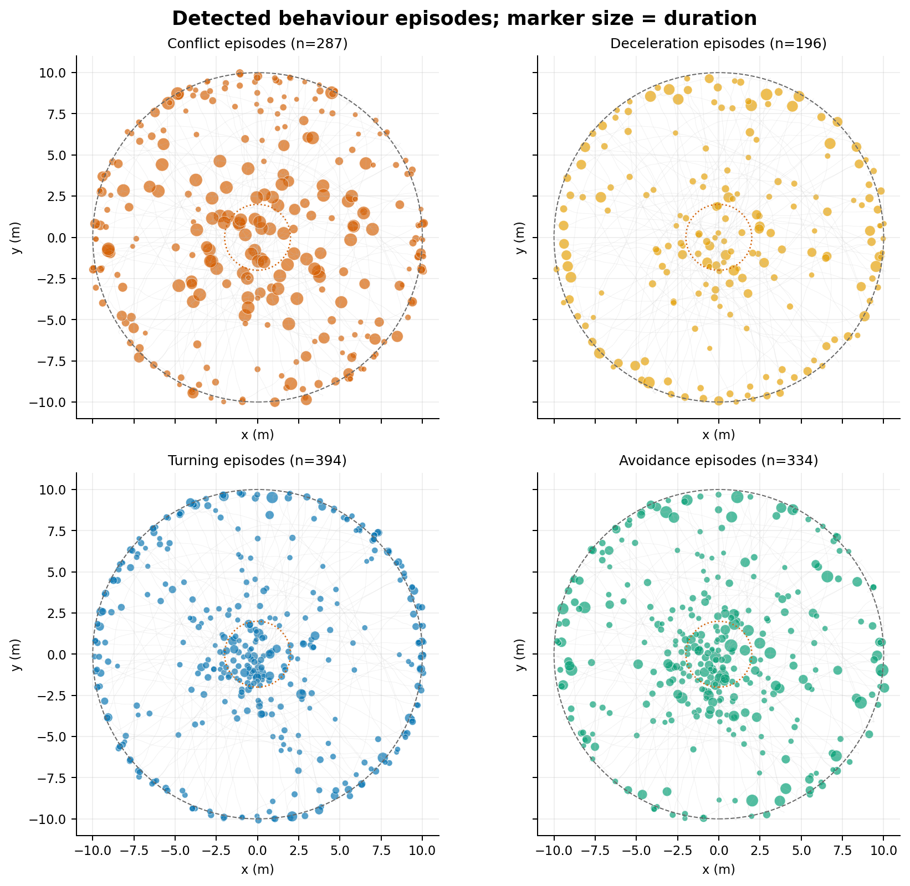
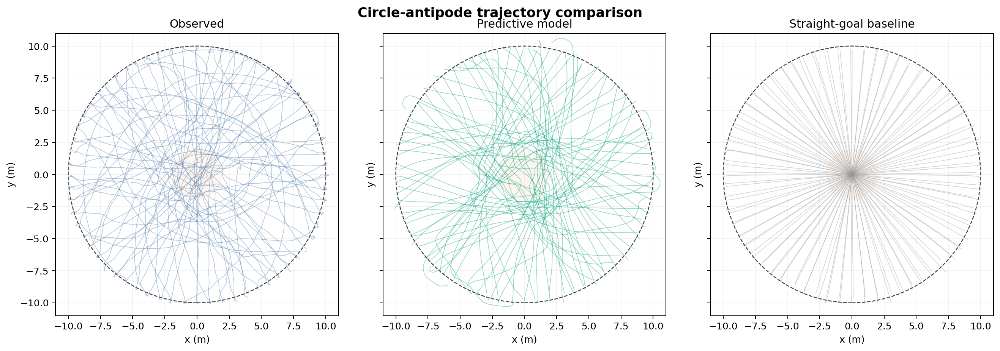
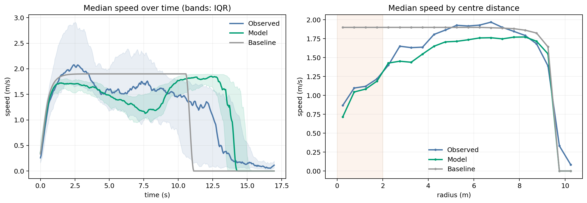
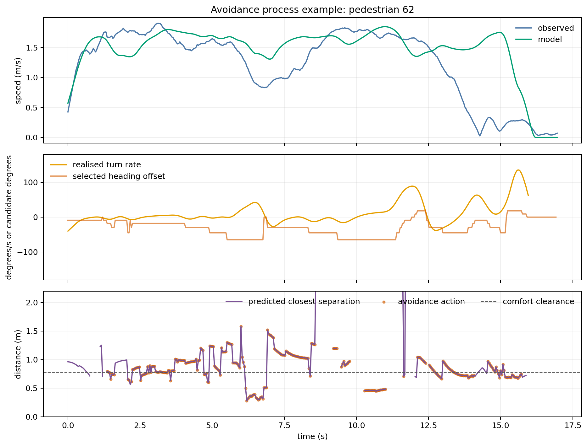

# Week 02：圆形对跖实验中的行人冲突与避让

## 结论

本数据支持一个“**目标驱动 + 冲突预判 + 右侧偏好**”的两层行为模型：

1. **战术层**：行人朝对跖目标移动，但不会始终走最短直线；预期中心拥挤时会选择绕行，方向选择带有右侧偏好。
2. **操作层**：局部碰撞风险升高后，行人通过减速、连续转向或两者组合完成避让，而不是突然改变轨迹。

本次分析得到两条可检验的行为判断：

- **判断 H1——右侧绕行偏好**：排除 5 条近中心路线后，44/59（74.6%）条路线位于行进方向右侧；相对“左右各 50%”的单侧二项检验为 \(p=1.02\times10^{-4}\)。预测：在同地区、相同实验设置的独立重复中，右侧比例仍应显著高于 50%。
- **判断 H2——中心冲突触发速度调节**：在实际进入 \(r\le2\) m 中心区的 37 人中逐人比较，中心速度中位数为 1.20 m/s，接近区 \(5\le r\le8\) m 为 1.88 m/s，下降约 36.2%，配对 Wilcoxon 检验 \(p=7.24\times10^{-8}\)。中心区逐行人的冲突帧比例中位数为 100%，接近区为 44.6%。预测：增加同时出发人数时，中心速度下降和避让帧比例应进一步增大。

这些是基于一轮实验的可复验判断，不是跨场景因果定律。

## 1. 数据与任务

输入文件为 [`circle-10m-64-1.txt`](../datasets/circle-10m-64-1.txt)，对应北京交通大学的 10 m 半径、64 人圆形对跖实验第一轮：行人均匀站在圆周上，同时走向各自的对跖点，最短路径在中心汇聚并产生高冲突区。

文件共 27,200 行：

- 64 名行人；
- 每人 425 帧；
- 25 fps，总时长 16.96 s；
- 五列依次为 `pedestrian_id, frame, x_cm, y_cm, height_cm`；
- 本分析将平面坐标由厘米转换为米。

轨迹由顶视视频经 PeTrack 提取。实验设计和原始发现见 Xiao et al. 的 [circle-antipode experiment 论文](https://arxiv.org/abs/1808.01443)。论文报告右侧偏好、中心冲突、随人数上升而增加的绕行，以及“调整通常渐进、剧烈转向较少”等现象。

## 2. 轨迹和速度变化



图中黑点为起点，虚线为半径 10 m 的实验边界，橙色浅圆为本分析定义的中心冲突区。大多数人在起点附近加速，在接近中心前达到较高速度，经过拥挤中心时出现减速和弯曲，抵达目标附近再次减速。



右图应注意：半径接近 10 m 的低速同时包含出发和到达阶段。因此 H2 没有用整个外圈作对照，而使用 \(5\le r\le8\) m 的接近区，避免起停阶段造成混淆。

## 3. 行为事件识别

位置先使用 15 帧（0.6 s）的二阶 Savitzky–Golay 滤波，再计算速度、切向加速度和转向角速度。事件规则如下：

| 事件 | 操作定义 |
|---|---|
| 冲突 `conflict` | 恒速外推 2 s 内，两人的预测最近间距小于 0.8 m；当前间距小于假定合并体径 0.6 m 时也计入 |
| 减速 `deceleration` | 行进速度大于 0.30 m/s，且平滑后的切向加速度小于 -0.60 m/s² |
| 转向 `turning` | 行进速度大于 0.30 m/s，且绝对转向角速度大于 35°/s |
| 避让 `avoidance` | 冲突前后 0.6 s 内出现减速或转向；这是复合行为候选 |

短暂的单帧触发会经过形态学闭合与去噪，并合并为连续事件。结果识别出：

| 类型 | 事件数 | 涉及行人数 | 事件持续时间中位数 |
|---|---:|---:|---:|
| 冲突 | 287 | 64 | 0.60 s |
| 减速 | 196 | 64 | 0.48 s |
| 转向 | 394 | 64 | 0.28 s |
| 避让 | 334 | 64 | 0.36 s |



圆心附近出现密集的转向和避让候选，符合最短路线集中汇聚的实验机制；圆周附近的事件则主要来自出发、到达以及相邻行人同步启动。事件数对阈值敏感，只能作为自动筛选结果，不能当作人工标注真值。

## 4. 模型主张和依据

### 模型主张

单纯的“朝目标直走”或仅依靠短程排斥的社会力模型不足以解释这些轨迹。最低限度的行为模型应包含：

1. 对跖目标产生的期望方向和期望速度；
2. 基于预测最近间距或 TTC 的前瞻冲突感知；
3. 风险升高时同时调节速度和方向；
4. 当左右绕行代价接近时，以右侧偏好作为破除对称性的先验；
5. 战术绕行与局部碰撞避免分层处理。

适合的实现形态是：战术层根据中心拥挤程度选择直穿或绕行路径，操作层使用 Anticipation Velocity Model、Voronoi 绕行或类似的速度—方向联合更新规则。

### 理论和资料依据

- 原始实验发现行人的路线调整通常平滑，右侧偏好明显；短路线在中心拥堵后未必更快。[Xiao et al., 2018/2019](https://arxiv.org/abs/1808.01443)
- 原论文使用圆形对跖轨迹评价传统 Social Force Model 与加入 Voronoi 绕行方向的改进模型；除路线长度外，改进模型在其他指标上表现更好，但两者都缺少宏观绕行机制。
- 后续轨迹评价研究在相同的 10 m、64 人实验上比较 SFM 与启发式模型，指出中心冲突同时需要路线选择和局部避让，且缺少宏观绕行会使仿真人群堵在中心。[轨迹评价论文](https://juser.fz-juelich.de/record/902571/files/Manu%20-%20Trajectory%20Evaluation.pdf)

### 本数据中的支持证据

| 证据 | 观察 | 支持的机制 |
|---|---|---|
| 路线左右分布 | 右 44、左 15、近中心 5；右侧比例 74.6% | 右侧偏好可作为对称场景的决策先验 |
| 中心速度变化 | 进入中心区的 37 人：中心 1.20 m/s，接近区 1.88 m/s | 风险/拥挤升高时主动调速 |
| 冲突暴露 | 中心冲突帧比例中位数 100%，接近区 44.6% | 中心是主要交互压力区 |
| 避让暴露 | 中心避让帧比例中位数 43.2%，接近区为 0 | 冲突附近会出现减速或转向反应 |
| 轨迹形状 | 大量连续弯曲路线，极少瞬时折线 | 方向更新应带反应时间和平滑约束 |

## 5. 可执行行为模型

代码位于 [`model/predictive_velocity_model.py`](model/predictive_velocity_model.py)，运行与评价入口为
[`simulate_circle.py`](simulate_circle.py)。模型是“**带右侧先验的预测候选速度模型**”，不是神经网络，也没有权重文件。

### 行人使用什么信息

每个行人在时刻 (t) 只读取：

1. 自身当前位置、当前速度、当前路径点和最终对跖目标；
2. 5 m 感知半径、220° 视野内邻居的位置和速度；身后 1.2 m 内仍保持感知；
3. 邻居在未来 2 s 内保持当前速度时的预测最近距离和到达最近点时间；
4. 群体初始规模，用于判断中心是否拥挤，并在右绕、左绕、直穿三个中心路径点之间选择。

模型不读取实测未来轨迹。初始位置和初速度来自实测首帧，目标由初始位置的对跖点得到。为抑制首帧导数噪声，初速度上限设为 1.2 m/s。

### 如何判断和更新

战术层对右绕、左绕和直穿使用随机效用选择。右绕具有数据支持的正先验，中心选项随群体规模增大而受罚；随机项表达个体差异，固定种子后可复现。

操作层每 0.04 s 生成一组候选速度：包括停止动作、期望速度的 38%–100%，以及相对目标方向 -65° 到 +65° 的方向。每个候选动作计算：

\[
J(v)=J_{goal}+0.18J_{smooth}+8J_{collision}+45J_{emergency}-0.25J_{right}.
\]

- (J_{goal})：候选速度偏离目标速度的程度；
- (J_{smooth})：候选速度偏离当前速度的程度；
- (J_{collision})：2 s 恒速外推下，预测间距低于 0.72 m 的代价；
- (J_{emergency})：预测间距低于 0.44 m 的额外代价；
- (J_{right})：发生紧迫迎面冲突时，对右侧动作的小幅奖励。

选出最低代价速度后，通过 0.42 s 反应时间更新；加速不超过 2.6 m/s²，减速不超过 3.4 m/s²。最后有一个 0.40 m 的点轨迹硬核约束处理同步更新造成的数值重合。该安全层不是行为解释，因此评价中单独报告其介入比例。

### 从真实初始状态仿真

```powershell
python Traj-OUHAOYU/week02/simulate_circle.py --stability-trials 8
```

主仿真和“不选路径、不避让”的直达目标基线均使用 64 人实测首帧，运行 425 帧。完整输出位于 [`results/simulation/`](results/simulation/)：

- [`trajectory_comparison.png`](results/simulation/trajectory_comparison.png)：实测、模型和直线基线轨迹；
- [`speed_comparison.png`](results/simulation/speed_comparison.png)：速度—时间和速度—中心距离比较；
- [`avoidance_process.png`](results/simulation/avoidance_process.png)：示例行人的速度、转向、预测间距和动作；
- [`simulation_decisions.csv`](results/simulation/simulation_decisions.csv)：逐人逐帧的可审计决策；
- [`simulation_report.json`](results/simulation/simulation_report.json)：参数、误差、稳定性门槛和失效检查。







### 对照结果

| 指标 | 实测 | 预测模型 | 直线基线 |
|---|---:|---:|---:|
| 观测时长内到达 0.5 m 目标区 | 98.4% | 96.9% | 100% |
| 全程速度中位数 | 1.383 m/s | 1.478 m/s | 1.890 m/s |
| 中心区速度中位数 | 1.120 m/s | 1.115 m/s | 1.900 m/s |
| 最小点轨迹间距 | 0.229 m | 0.392 m | 0.002 m |
| 冲突事件 | 287 | 304 | 81* |
| 减速 / 转向 / 避让事件 | 196 / 394 / 334 | 136 / 178 / 186 | 64 / 100 / 12* |
| 实现出来的右绕比例 | 74.6% | 93.7% | 不适用 |
| 速度中位曲线 RMSE | — | 0.422 m/s | 0.475 m/s |
| 逐帧平均位移误差 ADE | — | 2.675 m | 2.201 m |

\* 直线基线在中心几乎完全重合，恒速最近点事件会合并成长事件，所以“事件数更少”不代表更安全；其 0.002 m 最小间距直接表明它不可接受。

预测模型复现了中心减速，速度曲线也比直线基线更接近实测；硬核安全层只在 0.89% 的行人帧介入，最大修正 1.83 cm。它没有复现个体级路线：ADE 反而高于直线基线，而且局部右侧奖励把实现出来的右绕比例放大至 93.7%。因此当前模型支持“预判冲突后联合调速和转向”的机制，但还不能说明右绕强度已经校准正确。

### 稳定性与已观察到的失效

8 次复算分别加入约 2 cm 初始位置噪声、0.03 m/s 初速度噪声、4% 期望速度差异，并改变路径选择随机种子：

- 到达率范围 70.3%–98.4%，中位数 93.0%；
- 最小点轨迹间距均约 0.40 m，没有低于 0.35 m 的近重合；
- 战术层右绕比例为 58.3%–81.7%；
- 严格验收要求每轮到达率至少 90%，因此**当前模型没有通过稳定性验收**。

最差的 seed 1005 中，到达率为 70.3%，右绕比例最低（58.3%），避让动作率最高（51.3%）。在仅 8 轮的样本中，到达率与右绕比例相关系数为 0.85，与避让动作率为 -0.96；这只是诊断性线索，但符合“左右策略混合导致迎面局部僵持”的轨迹表现。当前最明确的失效情形是：群体没有形成足够一致的绕行侧别时，局部候选速度规则会过度减速并发生 reciprocal dance，无法在实验时长内到达。

## 6. 使用的资料与开源代码

### 本目录

- [`analyze_circle.py`](analyze_circle.py)：完整可复现分析，包括单位转换、平滑、运动学、TTC/最近接近距离、事件分段、统计检验和绘图。
- [`model/predictive_velocity_model.py`](model/predictive_velocity_model.py)：感知、预测、路径选择、候选速度决策和状态更新。
- [`simulate_circle.py`](simulate_circle.py)：从实测初态运行模型、直线基线、同口径比较和扰动稳定性测试。
- [`results/trajectory_kinematics.csv`](results/trajectory_kinematics.csv)：逐行人逐帧的位置、速度、加速度、转向率、最近邻和四类事件标志。
- [`results/behavior_events.csv`](results/behavior_events.csv)：连续事件级结果，包含时段、位置、持续时间、速度变化和冲突对象。
- [`results/pedestrian_summary.csv`](results/pedestrian_summary.csv)：逐行人的路线侧别、路程、旅行时间、中心/接近区速度和事件计数。
- [`results/event_summary.csv`](results/event_summary.csv)：四类事件汇总。
- [`results/analysis_summary.json`](results/analysis_summary.json)：README 中主要数字及所有阈值。

运行方法：

```powershell
python Traj-OUHAOYU/week02/analyze_circle.py
```

需要 Python 3.11、NumPy、Pandas、SciPy 和 Matplotlib。

### 外部代码与候选仿真框架

| 项目 | 许可证 | 用途 |
|---|---|---|
| [OpenTraj](https://github.com/crowdbotp/OpenTraj) | MIT | 当前仓库的数据组织、轨迹分析基础 |
| [JuPedSim](https://github.com/PedestrianDynamics/jupedsim) | LGPLv3 | 可直接使用 Python 的微观仿真平台，含 AVM、SFM、GCFM 和碰撞自由速度模型 |
| [PedPy](https://github.com/PedestrianDynamics/PedPy) | MIT | 统一计算速度、密度、流量、邻域和基本图 |
| [PySocialForce](https://github.com/yuxiang-gao/PySocialForce) | MIT | 传统/扩展社会力基线 |

本地代码没有复制 ORCA 或 JuPedSim 源文件。它借鉴了 ORCA“在预测碰撞约束下选择接近期望速度的动作”和 JuPedSim AVM“感知—预测—策略选择”的公开结构，再以有限候选速度实现。差异和许可证记录在 [`model/SOURCES.md`](model/SOURCES.md)。当前实现是可检验的研究原型，不是新的开源 SOTA。

## 7. 何时会失效

### 行为模型的失效边界

- **文化与交通规则变化**：右侧偏好来自中国实验参与者，在左行文化、不同年龄或不同任务压力下可能反转或消失。
- **非对称环境**：本实验没有墙、障碍物、入口和多个目标。现实环境中的视野遮挡、出口吸引和组团行为可能主导路线选择。
- **极高密度或身体接触**：基于速度和预测间距的模型不能描述推挤、身体旋转、跌倒和力链传播。
- **目标未知或临时改变**：分析已知每人的对跖目标；开放场景需要同时推断意图，误判目标会把正常转向识别为避让。
- **跨人数泛化**：这里只有 10 m–64 人的一轮数据，不能单独证明模型适用于 8/16/32 人或 5 m 圆。
- **左右策略混合**：稳定性测试已实际观察到局部僵持；这不是假设性的风险。
- **过强右侧先验**：主运行实现的右绕为 93.7%，高于实测 74.6%，说明战术偏好与局部右避让发生了叠加。
- **安全层掩盖失败**：0.40 m 硬核投影保证点轨迹不完全重合，但它不能证明行为规则本身无碰撞；因此必须同时检查其介入率。
- **个体路线不可预测**：随机路径选择可以复现群体比例，但无法知道某个具体行人会选左还是右，导致逐帧 ADE 偏高。

### 自动识别的失效边界

- TTC/最近接近距离采用短时恒速假设；强转向时会过度预警或漏检。
- 0.6 m 合并体径、0.8 m 风险间距、2 s 预测窗均为可解释阈值，不是该数据的人工标注最优值。
- 头部轨迹不等于身体轮廓；身高投影误差和遮挡会放大速度、加速度与转向率。
- 0.6 s 平滑窗会抑制快速反应；更短窗口会增加跟踪噪声导致的伪事件。
- “避让”要求冲突邻近时出现减速或转向，但无法仅凭轨迹确认行人的主观动机。
- 单轮数据上的显著性不能替代跨重复实验验证；尤其 H2 目前是关联证据，不能单独证明冲突造成减速。

## 8. 下一步验证

1. 加入同实验其余三轮以及 8/16/32 人数据，按实验轮次做留一验证，而不是继续拟合本轮；
2. 将单次随机路径选择改为根据左右预测流量动态重估，但加入滞回，减少 reciprocal dance；
3. 由两名标注者抽查冲突和避让事件，报告 precision、recall 和 Cohen's kappa；
4. 用同一初始位置运行官方 JuPedSim AVM/ORCA 实现，避免只和不可用的直线基线比较；
5. 只有当模型在未参与调参的重复实验中同时复现 H1、H2、事件分布且所有扰动轮通过到达率门槛，才认为行为主张得到模型层面的支持。
