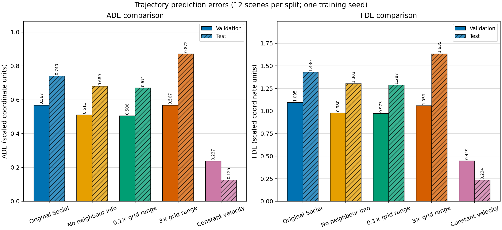
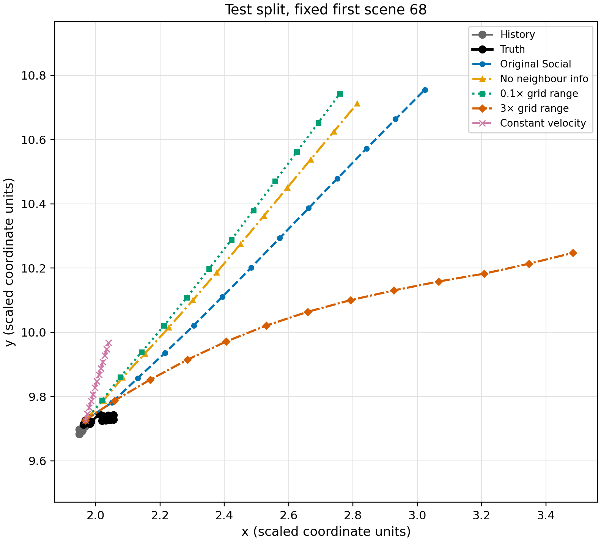

# Social LSTM 四模型统筹对比

## 统一实验设置

本报告在同一评价协议下重新加载并评价四个 `seed=42`、10 轮模型：

| 模型 | 关键配置 | 总网格边长 | 参数量 |
|---|---|---:|---:|
| 原 Social | `n=4, cell_side=1.0` | 4.0 | 25,777 |
| 去邻居信息 | Social 结构不变，池化输入固定为零网格 | — | 25,777 |
| 十分之一网格 | `n=4, cell_side=0.1` | 0.4 | 25,777 |
| 三倍邻域 | `n=4, cell_side=3.0` | 12.0 | 25,777 |

所有模型都使用历史 8 点预测未来 12 点。评价时只传入历史，64 名行人均由模型递推；ADE/FDE 只统计每个场景的主要行人。验证和测试各有 12 个场景。误差单位为换算后坐标单位，原始厘米换算假设尚未由元数据确认。

只有一个训练随机种子，窗口存在重叠，因此没有绘制误差条或置信区间；12 个场景也不是独立重复实验。

## ADE/FDE 汇总

| 集合 | 模型 | ADE | FDE | 相对原模型 ADE | 相对原模型 FDE |
|---|---|---:|---:|---:|---:|
| 验证 | 原 Social | 0.5672 | 1.0947 | — | — |
| 验证 | 去邻居信息 | 0.5111 | 0.9797 | -9.89% | -10.51% |
| 验证 | 十分之一网格 | **0.5056** | **0.9726** | -10.86% | -11.15% |
| 验证 | 三倍邻域 | 0.5669 | 1.0593 | -0.05% | -3.24% |
| 验证 | 匀速外推 | 0.2373 | 0.4491 | — | — |
| 测试 | 原 Social | 0.7401 | 1.4295 | — | — |
| 测试 | 去邻居信息 | 0.6796 | 1.3028 | -8.17% | -8.87% |
| 测试 | 十分之一网格 | **0.6706** | **1.2870** | -9.38% | -9.97% |
| 测试 | 三倍邻域 | 0.8723 | 1.6345 | +17.87% | +14.34% |
| 测试 | 匀速外推 | 0.1251 | 0.2339 | — | — |

粗体表示四个学习模型中的最佳结果。匀速外推不参与粗体排名，因为它不是本次训练模型，但它在两个集合上都明显更好。



图像替代文字：两个从零开始的并列柱状图分别展示 ADE 和 FDE。每种方法各有验证集实心柱和测试集斜线柱。十分之一网格是四个学习模型中最低，去邻居信息次之，原 Social 居中，三倍邻域在测试集最高。匀速外推在两个指标和两个集合上都最低。

## 固定场景轨迹



固定测试场景 68：

| 模型 | ADE | FDE |
|---|---:|---:|
| 原 Social | 0.7358 | 1.4117 |
| 去邻居信息 | 0.6449 | 1.2421 |
| 十分之一网格 | **0.6397** | **1.2356** |
| 三倍邻域 | 0.8001 | 1.5200 |
| 匀速外推 | 0.1288 | 0.2401 |

图像替代文字：场景 68 中，真实未来在历史终点附近短距离转向。四个学习模型都把轨迹外推过远。十分之一网格和去邻居信息轨迹相近，原 Social 偏离更大；三倍邻域沿水平方向外推最远。匀速外推仍有偏差，但远小于四个学习模型。

## 三个修改方向的代码

### 1. 删除邻居信息

代码位于 `neighbor_ablation/model.py`。`NoNeighborGridBasedPooling` 继承原 `GridBasedPooling`，保留网格编码层、主 LSTM 输入维度和参数形状，但覆盖 `social()`：

```python
def social(self, hidden_state, obs1, obs2):
    batch_size, num_tracks = obs2.shape[:2]
    return torch.zeros(
        batch_size * num_tracks,
        self.pooling_dim,
        self.n,
        self.n,
        device=obs2.device,
        dtype=hidden_state.dtype,
    )
```

训练器增加了 `--type social_no_neighbors` 入口。该模型排除邻居隐藏状态、相对位置、数量和排列，同时避免像 Vanilla 那样改变主结构和参数量。

### 2. 十分之一网格

不修改模型类，只覆盖训练参数：

```powershell
run_classroom.py --type social --cell_side 0.1 --output grid_tenth
```

`n=4` 不变，总边长从 4.0 变为 0.4。真实数据中主要行人的网格在训练、验证和测试时间步均为空，因此它实际近似邻居信息消融，而不是拥有充分极近邻样本的模型。

### 3. 三倍邻域

同样不修改模型类，只覆盖参数：

```powershell
run_classroom.py --type social --cell_side 3.0 --output grid_triple
```

`n=4` 不变，总边长从 4.0 变为 12.0。范围扩大同时使格子变粗。训练集主要行人的平均入网邻居从 6.40 增至 34.19，每个时间步都发生同格冲突，约 69.29% 的入网邻居被覆盖。

统一评价和绘图代码位于 `combined_comparison/build_comparison.py`；其输出保留 PNG、SVG、汇总 CSV、逐场景 CSV、JSON 和数据来源清单。

## 最终发现

1. **当前邻居池化整体没有提升这个课堂小样本。** 去掉邻居信息后，测试 ADE/FDE 分别改善 8.17%/8.87%。这比 Vanilla 对比更公平，因为主结构和参数量保持不变。
2. **十分之一网格是学习模型中的最佳配置，但不能解释为“极近邻最优”。** 它几乎从未包含邻居，结果与零邻居消融接近；实质上再次说明当前邻居信号没有产生收益。
3. **三倍邻域泛化最差。** 大范围配合固定 `4×4` 网格导致空间分辨率降低和同格覆盖激增；验证集近似持平，但测试 ADE/FDE 恶化 17.87%/14.34%。
4. **同格覆盖是重要实现限制。** 原代码用索引赋值填格，不是求和或平均。邻居越多，越多信息被覆盖，输出还会依赖邻居排列顺序。
5. **匀速外推远好于全部学习模型。** 当前 56 个训练场景、单一时间序列阶段和 10 轮小模型不足以证明复杂池化优于简单运动先验。

综合结论：在当前数据、训练轮数和覆盖式网格实现下，减少或排除邻居输入比扩大邻域更稳定；但这不能推广为“行人交互无用”。下一步应先把同格覆盖改为明确的平均/求和池化，再选择仍能覆盖一定邻居的中间范围，并使用多个随机种子重复实验。

## 数据与复现文件

- `results/metrics_summary.csv`：验证/测试 ADE/FDE 汇总。
- `results/per_scene_metrics.csv`：每个场景、每个模型的原始 ADE/FDE。
- `results/combined_metrics.json`：汇总、逐场景结果和参数量。
- `results/metrics_comparison.png`、`.svg`：ADE/FDE 图。
- `results/trajectory_comparison.png`、`.svg`：固定场景轨迹图。
- `results/figure_manifest.json`：权重来源、变换步骤、软件版本和随机种子。

## 可视化方法参考

Kassis, T., Agarwal, V., He, Y., Patel, D., & Brueckner, A. M. (2026). *Scientific Agent Skills: A Library of Procedural Knowledge for Research Agents*. arXiv:2609.00065. https://doi.org/10.48550/arXiv.2609.00065
